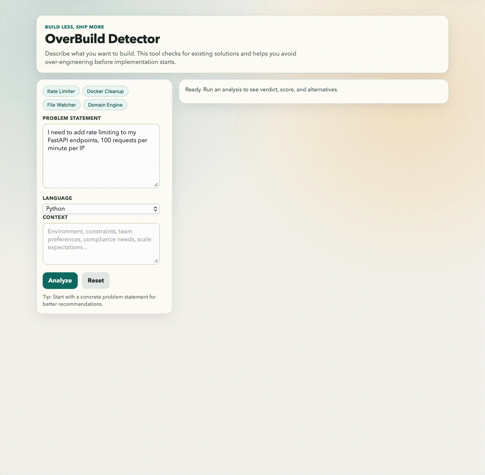

# OverBuild Detector

Before you build, check if it already exists.



OverBuild Detector analyzes a problem statement and recommends one of:

- `USE_EXISTING`
- `ADAPT_EXISTING`
- `BUILD_CUSTOM`
- `JUST_USE_A_ONE_LINER`

It runs a deterministic pipeline:

1. Parse intent (LLM call #1 with structured output, heuristic fallback).
2. Search providers in parallel (Libraries.io, GitHub, StackOverflow, npm, Ecosyste.ms).
3. Deduplicate and rank results deterministically.
4. Synthesize recommendation (LLM call #2 with structured output, heuristic fallback).
5. Return score, verdict, and actionable alternatives.

## Architecture

```text
User Problem
  -> Parse Intent
  -> Parallel Search
  -> Deduplicate + Rank
  -> Synthesize Recommendation
  -> AnalyzeResponse JSON
```

## Architecture Decisions

| Decision | Choice | Why This Choice | Trade-off |
| --- | --- | --- | --- |
| Orchestration style | Deterministic pipeline (not multi-agent graph) | The flow is fixed and auditable for decision support workloads. | Less flexible for open-ended agent behavior. |
| Intent + synthesis | 2 LLM stages with structured output | Separates understanding from recommendation and keeps outputs strongly typed. | Two model calls add latency and cost. |
| Fallback strategy | Heuristic fallback when LLM/API keys are missing | Service remains usable in low-connectivity or low-budget mode. | Lower recommendation quality than full mode. |
| Retrieval strategy | Multi-source async search (`Libraries.io`, GitHub, StackOverflow, Ecosyste.ms, conditional npm) | Better coverage and faster response via parallel I/O. | External API reliability/rate-limits must be handled. |
| Ranking strategy | Deterministic weighted scoring + deduplication | Predictable and explainable ranking behavior across runs. | Weights require periodic tuning by domain. |
| Data contracts | Pydantic request/response models end-to-end | Strong schema guarantees across API, CLI, and MCP surfaces. | Schema updates require coordinated changes. |
| Interface strategy | Same core pipeline exposed via API, CLI, and MCP | One source of truth for logic, multiple adoption paths. | More surface area to test and document. |
| Deployment packaging | Multi-stage Docker + non-root user + healthcheck | Smaller, safer, production-shaped container setup. | Slightly more complex Dockerfile than single-stage builds. |
| Cache strategy | In-memory TTL cache by default | Zero infra dependencies for local/portfolio usage. | Cache is process-local and not shared across instances. |

## OverBuild Score Guide

OverBuild Score is a **ratio**, not a percentage and not a fixed `/10` scale:

`OverBuild Score = custom_build_complexity / problem_complexity`

In the current heuristic model, practical values are typically in the `1.3` to `4.0` range.

Interpretation:

- `1.30 to 1.45`: low overbuild risk
- `1.46 to 1.90`: moderate overbuild risk, adapt existing tools first
- `1.91 to 2.60`: high overbuild risk, prefer existing solutions
- `>2.60`: very high overbuild risk, package or one-liner is usually enough

## Prerequisites

- Python `3.11+` (Docker image uses `3.12`)
- `uv` installed
- Docker Desktop (for Docker flow)

## Environment Setup

```bash
cp .env.example .env
```

`.env` keys:

- Required for full quality:
  - `OVERBUILD_LLM_PROVIDER` (`anthropic` | `openai` | `google`)
  - `OVERBUILD_LLM_MODEL` (provider-specific model name)
  - `OVERBUILD_LLM_API_KEY`
- Recommended:
  - `OVERBUILD_LIBRARIESIO_API_KEY`
  - `OVERBUILD_GITHUB_TOKEN`
  - `OVERBUILD_STACKOVERFLOW_API_KEY`

Provider examples:

- Anthropic:
  - `OVERBUILD_LLM_PROVIDER=anthropic`
  - `OVERBUILD_LLM_MODEL=claude-sonnet-4-20250514`
- OpenAI:
  - `OVERBUILD_LLM_PROVIDER=openai`
  - `OVERBUILD_LLM_MODEL=gpt-4.1-mini`
- Google:
  - `OVERBUILD_LLM_PROVIDER=google`
  - `OVERBUILD_LLM_MODEL=gemini-2.5-flash`

Notes:

- If `OVERBUILD_LLM_API_KEY` is empty, provider-specific fallback keys are supported:
  - `OVERBUILD_ANTHROPIC_API_KEY`
  - `OVERBUILD_OPENAI_API_KEY`
  - `OVERBUILD_GOOGLE_API_KEY`
- If no valid LLM key is configured, the app automatically uses heuristic fallback mode.

## Quick Start (CLI)

```bash
uv pip install -e ".[dev]"
overbuild --demo
```

Example:

```bash
overbuild "I need to add rate limiting to my FastAPI endpoints, 100 requests per minute per IP" --language python
```

## Usage: API Server

1. Install dependencies:

```bash
uv pip install -e ".[dev]"
```

2. Start API server:

```bash
uvicorn overbuild.main:app --reload
```

3. Open web UI:

- `http://127.0.0.1:8000/`
- Run an analysis and use `Export JSON` or `Export Markdown` from the results panel.

4. Health check:

```bash
curl http://127.0.0.1:8000/health
```

5. Analyze request:

```bash
curl -X POST http://127.0.0.1:8000/analyze \
  -H "Content-Type: application/json" \
  -d '{
    "problem": "I need to add rate limiting to my FastAPI endpoints, 100 requests per minute per IP",
    "language": "python",
    "context": "Production API with burst traffic"
  }'
```

6. Metrics:

```bash
curl http://127.0.0.1:8000/metrics
```

Interactive docs: `http://127.0.0.1:8000/docs`

## Usage: MCP Server Mode

1. Start MCP server:

```bash
python -m overbuild.mcp.server
```

2. Register MCP server in your MCP client config:

```json
{
  "mcpServers": {
    "overbuild": {
      "command": "python",
      "args": ["-m", "overbuild.mcp.server"]
    }
  }
}
```

Alternative with `uv`:

```json
{
  "mcpServers": {
    "overbuild": {
      "command": "uv",
      "args": ["run", "-m", "overbuild.mcp.server"]
    }
  }
}
```

3. Restart your MCP client and call tool:

- Tool: `check_before_building`
- Minimum input:

```json
{
  "problem": "Build a script to clean up dangling Docker images older than 48h"
}
```

## Usage: Docker Mode

### Option A: Docker Compose

```bash
docker compose up --build
```

Test:

```bash
curl http://127.0.0.1:8000/health
```

```bash
curl -X POST http://127.0.0.1:8000/analyze \
  -H "Content-Type: application/json" \
  -d '{
    "problem": "Create a file watcher that reruns tests on changes",
    "language": "python"
  }'
```

Stop:

```bash
docker compose down
```

### Option B: Plain Docker

```bash
docker build -t overbuild-detector:local .
docker run --rm -p 8000:8000 --env-file .env overbuild-detector:local
```

## Evaluation

```bash
python eval/run_eval.py --output eval/results/latest.json
```

## API

`POST /analyze`:

```json
{
  "problem": "I need rate limiting for FastAPI endpoints",
  "language": "python",
  "context": "100 req/min per IP"
}
```

- `GET /health`
- `GET /metrics`

## Testing

```bash
ruff check src tests eval scripts
pytest -v
```

## CI/CD

- CI workflow: lint, format check, mypy, pytest.
- Deploy gate: pytest + docker build on `main`.

## Deployment

- [Render](docs/deploy_render.md) — recommended for personal and portfolio hosting (free tier available).
- Railway — alternative PaaS option; connect repo for auto-deploy.
- AWS ECS Fargate — production-scale; Terraform config in `infra/terraform/`.

## Enterprise Enhancements

OverBuild Detector can be extended into an enterprise-grade tool with access to internal codebases, private package registries, CI/CD gates, compliance layers, and org-wide analytics.

See [docs/enterprise_enhancements.md](docs/enterprise_enhancements.md) for the full guide — including architecture notes on where each enhancement plugs into the existing pipeline.

## Future Enhancements (Planned)

### Phase 1: Product Polish

- Enhance web UI with session history and shareable analysis links.
- Add request presets/templates:
  - "DevOps cleanup", "API middleware", "data scripts", "domain-specific system".
- Extend export options:
  - Add copy-to-clipboard and PDF export formats for reports.
- Add scoring explainability:
  - Show why each candidate ranked high (keyword match, stars, maintenance, language fit).

### Phase 2: Customization & Team Use

- Add "strictness profile" setting:
  - conservative (prefer reuse), balanced, aggressive (allow custom build sooner).
- Add domain packs:
  - Backend, DevOps, Data, Frontend, Security (domain-specific heuristics + search hints).
- Add user feedback loop:
  - "Accepted/Rejected recommendation" feedback to tune heuristics and prompts.
- Add history and trend tracking:
  - Verdict distribution, average score, and frequent one-liner categories over time.

### Phase 3: Advanced Intelligence

- Add confidence scoring + abstain mode:
  - Return low-confidence signal and ask for more context instead of forcing a verdict.
- Add hybrid retrieval:
  - Blend API search with embedding-based similarity against curated solution examples.
- Add policy-aware recommendations:
  - Respect constraints such as license policy, allowed package sources, and runtime restrictions.
- Add batch analysis endpoint:
  - Evaluate multiple problem statements in one request for planning sessions.

## Core Logic: Best Places for Personal Touch

1. Intent parsing and complexity detection:
   - `src/overbuild/core/parser.py`
   - Customize domain detection, complexity heuristics, one-liner detection, and search-query generation.
2. Ranking and relevance strategy:
   - `src/overbuild/search/aggregator.py`
   - Adjust scoring weights for keyword match, popularity, maintenance, and language alignment.
3. Verdict policy and recommendation style:
   - `src/overbuild/core/synthesizer.py`
   - Tune verdict thresholds, summary tone, pros/cons style, and "if you must build" guidance.
4. OverBuild score model:
   - `src/overbuild/core/scorer.py`
   - Personalize formula and explanation bands to match your engineering philosophy.
5. Pipeline orchestration and metrics:
   - `src/overbuild/core/pipeline.py`
   - Add caching strategy changes, trace steps, and richer observability.
6. Data contracts and API shape:
   - `src/overbuild/api/models.py`
   - Add fields like confidence, evidence breakdown, and recommendation rationale.

## License

Apache License 2.0 — free to use and build on, with attribution required.
See [LICENSE](LICENSE) and [NOTICE](NOTICE).

Original concept and architecture by **Akshay Dhotre** ([@akshayDhotre](https://github.com/akshayDhotre)).
